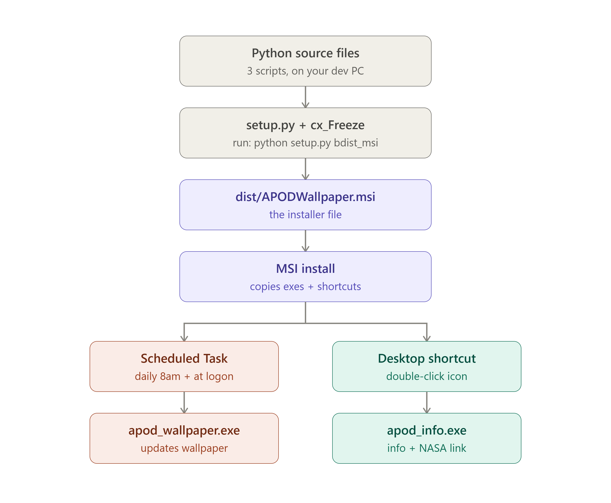

# APOD Wallpaper

Automatically downloads NASA's [Astronomy Picture of the Day](https://apod.nasa.gov/apod/astropix.html)
and sets it as your Windows 11 desktop wallpaper, once a day.

## "Today's Astronomy Picture" info shortcut

A desktop shortcut named **"Today's Astronomy Picture"** shows the current
image's title, date, credit, and full NASA description, plus two buttons:

- **Open on NASA website** — opens the real APOD page for that image
  (e.g. `https://apod.nasa.gov/apod/ap260721.html`) in your default browser.
- **Open full-size image** — opens the downloaded image file directly.

It reads from `%LOCALAPPDATA%\APODWallpaper\state.json`, which gets updated
every time the wallpaper changes, so it always reflects the current wallpaper.

- **Option A install**: the shortcut is created automatically on your Desktop
  by `install_task.ps1`.
- **Option B (MSI) install**: the shortcut is created automatically on your
  Desktop as part of installing the MSI — no extra step needed for this one.

## How it works

- `apod_wallpaper.py` calls NASA's official APOD JSON API (the same data
  that powers the page you linked), downloads that day's image to
  `%LOCALAPPDATA%\APODWallpaper\images\`, and sets it as your wallpaper
  using the Windows API.
- If a given day's APOD is a video instead of an image, it automatically
  falls back to the most recent day that *is* an image.
- Old cached images older than 14 days are auto-deleted (configurable).
- A Windows Task Scheduler entry runs it once daily (8:00 AM) and once at
  every logon, so it stays current even if the laptop was off/asleep at
  8 AM.
- Nothing is admin-only — everything installs and runs per-user.

## Get a free NASA API key (recommended, takes 30 seconds)

The script works out of the box with NASA's shared `DEMO_KEY`, but that
key is rate-limited across *everyone* using it (~30 requests/hour,
~50/day) so it can occasionally fail. Get your own free key:

1. Go to https://api.nasa.gov
2. Fill in the form — you get the key instantly by email, no approval wait.
3. After first running the app once, edit
   `%LOCALAPPDATA%\APODWallpaper\config.json` and replace `"DEMO_KEY"`
   with your key.

## Option A — Quick install (recommended, no build step)

Requires Python 3.9+ to already be on the machine
(https://www.python.org/downloads/ — check "Add python.exe to PATH"
during install). This is the easiest path and what most people should use.

1. Copy this whole folder to the target machine.
2. Right-click `install_task.ps1` → **Run with PowerShell**
   (or open PowerShell in this folder and run:
   `powershell -ExecutionPolicy Bypass -File install_task.ps1`)
3. That's it. It registers the daily task and sets today's wallpaper
   immediately so you see it working.

To remove it later: run `uninstall_task.ps1` the same way.

## Option B — Build a real .msi installer (no Python needed by end users)

This produces a standalone `.msi` that anyone can double-click to install
— it bundles its own Python runtime, so end users don't need Python
installed at all. **The build step itself must be done on a Windows
machine** (Windows Installer packages can't be built from Linux/Mac);
if you don't have a Windows box handy, a free GitHub Actions
`windows-latest` runner works fine too.

1. On a Windows machine, install Python 3.10+.
2. Copy this folder there.
3. Double-click `build_msi.bat` (or run `pip install cx_Freeze` then
   `python setup.py bdist_msi`).
4. Find the installer in the `dist\` folder, e.g.
   `APODWallpaper-1.0.0-win64.msi`.
5. Distribute that `.msi` — anyone can double-click it to install to
   `Program Files\APODWallpaper`.
6. After installing, the user runs the **"setup_task"** shortcut created
   in the Start Menu once — this registers the daily scheduled task and
   sets the wallpaper immediately. (MSI custom actions that auto-run
   post-install reliably require the WiX toolset rather than cx_Freeze;
   this one extra click keeps the build simple and dependable. Say the
   word if you'd like the more involved WiX version that skips even
   that click.)

## Why the wallpaper sometimes shows "yesterday's" APOD

NASA APOD is published on US time, not your local time. Its "day" rolls
over around midnight US Eastern time, which lands somewhere around
9:30–11:00 AM India time (and can be later — NASA doesn't publish at a
perfectly fixed time). If the scheduled task runs earlier than that in
your time zone, it will correctly fetch whatever NASA is currently
serving — which may still be the previous day's picture.

This is expected, not a bug. Two things make it self-correcting:

1. The default daily trigger is set to run at **1:00 PM** local time,
   comfortably after NASA's typical rollover.
2. The app always checks NASA's actual published date on every run —
   not just "did we already run today" — so the very next run (whether
   that's the next scheduled time, the next logon, or you manually
   re-running it) will pick up the new picture as soon as NASA has it,
   even if an earlier run that same day got the older one.

If you want to be extra sure, you can add a second daily trigger a few
hours later in Task Scheduler (right-click the task → Properties →
Triggers → New), as a safety net for days NASA publishes late.

## Configuration

Edit `%LOCALAPPDATA%\APODWallpaper\config.json` (created on first run):

```json
{
  "api_key": "DEMO_KEY",
  "prefer_hd": true,
  "keep_days": 14,
  "wallpaper_style": "fill"
}
```

- `wallpaper_style`: `fill` | `fit` | `stretch` | `tile` | `center` | `span`
- `prefer_hd`: use the high-resolution image when NASA provides one
  (larger download, sharper on big/4K screens)
- `keep_days`: how many days of old wallpapers to keep cached locally

## Logs & troubleshooting

- Log file: `%LOCALAPPDATA%\APODWallpaper\apod_wallpaper.log`
- To run it manually and watch output:
  `python "%LOCALAPPDATA%\APODWallpaper\apod_wallpaper.py"`
- To check/edit the scheduled task: open **Task Scheduler** →
  look for **"APOD Daily Wallpaper"**.
- Common cause of failure: no internet at the scheduled time — the
  logon trigger covers most of these cases, or just wait for the next
  day's run.

## Files in this package

| File | Purpose |
|---|---|
| `apod_wallpaper.py` | Core logic: fetch APOD, download image, set wallpaper |
| `apod_info.py` | Desktop info window: shows today's title/description, links to NASA page |
| `install_task.ps1` | Quick installer (Option A) |
| `uninstall_task.ps1` | Removes the scheduled task / files |
| `setup.py` | cx_Freeze build script → produces the .msi (Option B) |
| `setup_task.py` | Compiled into `setup_task.exe`; registers the task post-install |
| `build_msi.bat` | One-click MSI build wrapper for Option B |

## MSI Build Runtime Flow


